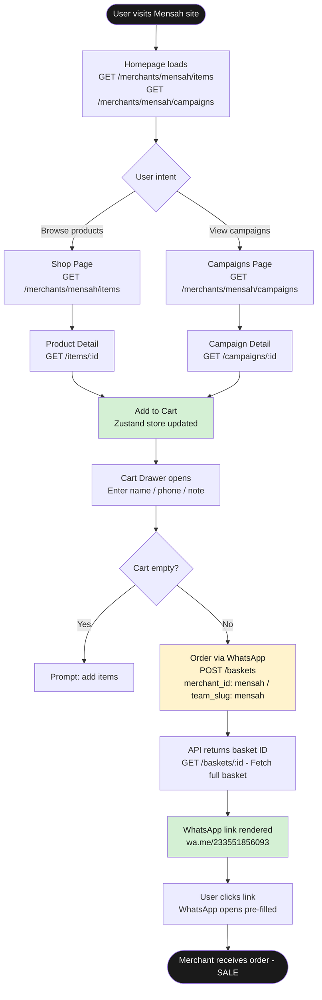
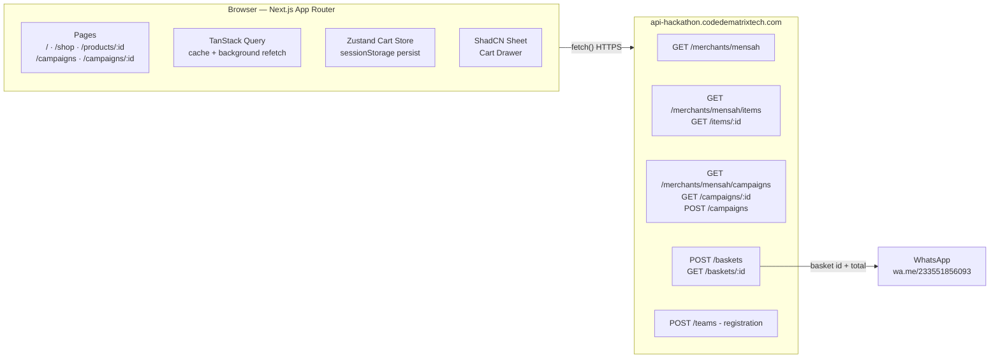

# Mensah — User Flow & Architecture (Miro Content)

Use this for **Option B (LLM-Assisted Flow)** in the hackathon. You can explain and present these flows.

---

## Diagram 1: User Journey Flow

---

## Diagram 2: System Architecture

---

## What to say when presenting the Miro board

> "We mapped the full user journey from landing on the Mensah site through to a completed WhatsApp order. The frontend is a Next.js App Router app that fetches inventory and campaigns from the hackathon API. The checkout flow creates a basket via POST /baskets, retrieves the full basket detail, then generates a WhatsApp deep-link pre-filled with the order summary — the merchant receives it directly in WhatsApp and can reply to confirm. We tag every basket and campaign with team_slug: 'mensah' for data attribution."
